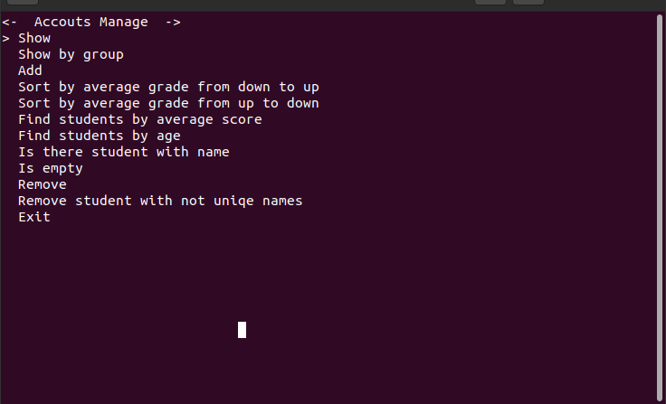
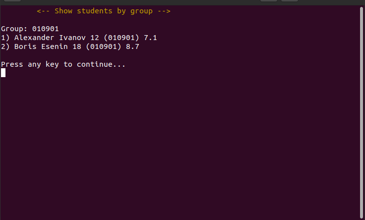

# Task
1. Create container class (**std::list**).
2. **Use**: unique, find, any_of, copy_if, sort. 

## How to compile?
``` bash
cd bin/
cmake ../src/
make
```
This wiil create a `bin/Lab2` executable file using cmake.

## How to use?
### Run
``` bash
cd bin/
./Lab2
```
or use `--init` flag to create default student list:
``` bash
cd bin/
./Lab2 --init
```

### Use




- k - Up
- j - Down
- i - Enter